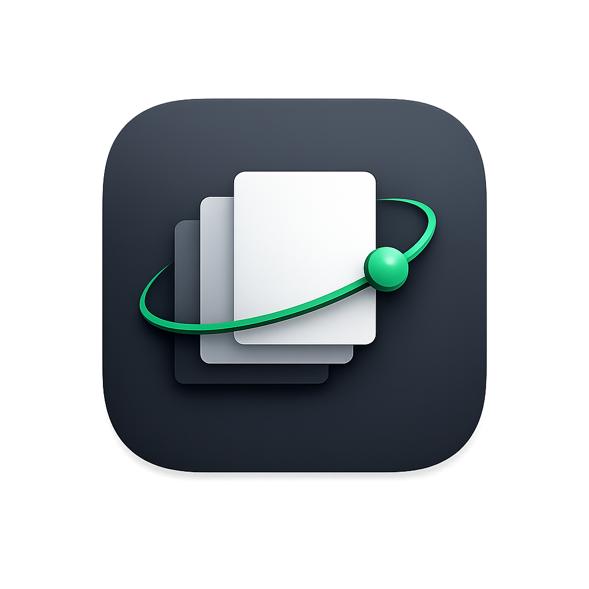

<p align="center">
  
</p>

<h1 align="center">OpenFolio</h1>

<p align="center">
  <strong>Open-source, local-first relationship memory for macOS</strong>
</p>

<p align="center">
  <a href="https://github.com/unlatch-ai/OpenFolio/releases/latest"></a>
  &nbsp;
  
  &nbsp;
  <a href="https://github.com/unlatch-ai/OpenFolio/blob/main/LICENSE"></a>
</p>

<p align="center">
  <a href="https://openfolio.ai">Website</a> &middot;
  <a href="https://openfolio.ai/docs">Documentation</a> &middot;
  <a href="https://github.com/unlatch-ai/OpenFolio/releases/latest">Download</a> &middot;
  <a href="https://github.com/unlatch-ai/OpenFolio/issues">Report an Issue</a>
</p>

---

OpenFolio is a native macOS app that builds a personal knowledge graph from your relationships — who you know, how you met, what you talked about, what matters. Your data lives in a local SQLite database on your Mac. No cloud required.

An optional hosted account unlocks identity, billing, AI entitlements, and managed connectors — but the local graph is always yours.

## Highlights

- **Local-first** — SQLite on your machine is the source of truth. Works offline, no account needed.
- **AI-powered** — Surface context, draft messages, and find patterns across your relationship history.
- **Messages import** — Pull in your macOS Messages history to enrich the graph automatically.
- **MCP server** — Expose your relationship graph to AI assistants via the Model Context Protocol.
- **Open source** — AGPL-3.0. Read the code, fork it, contribute back.

## Getting Started

1. Download the latest `.dmg` from the [releases page](https://github.com/unlatch-ai/OpenFolio/releases/latest)
2. Open the DMG and drag **OpenFolio.app** to your Applications folder
3. Launch OpenFolio and start building your graph

## Building from Source

**Requirements:** Node.js 22+, [pnpm](https://pnpm.io/) 10+

```bash
git clone https://github.com/unlatch-ai/OpenFolio.git
cd OpenFolio
pnpm install
pnpm dev        # Run the Electron app in dev mode
```

<details>
<summary><strong>All commands</strong></summary>

| Command | Description |
|---------|-------------|
| `pnpm dev` | Run the Mac app in development mode |
| `pnpm dev:web` | Run the website locally |
| `pnpm dev:hosted` | Run the Convex backend locally |
| `pnpm typecheck` | Type-check all packages |
| `pnpm test` | Run all tests |
| `pnpm build` | Build all packages |

</details>

## Architecture

```
apps/
  mac/          Electron app — shell, renderer, auto-updater
  web/          Public site, docs, and hosted account page (Next.js)

packages/
  core/         Local SQLite graph, Messages import, search, embeddings, AI
  mcp/          CLI and MCP server for the local graph
  hosted/       Convex backend — identity, billing, entitlements
  shared-types/ Shared type contracts
```

## Contributing

Contributions are welcome. If you find a bug or have an idea, please [open an issue](https://github.com/unlatch-ai/OpenFolio/issues/new). Pull requests are appreciated — just make sure `pnpm typecheck` and `pnpm test` pass before submitting.

## License

[AGPL-3.0](LICENSE)

---

<p align="center">
  Built by <a href="https://github.com/TheSnakeFang">Kevin Fang</a>
</p>
