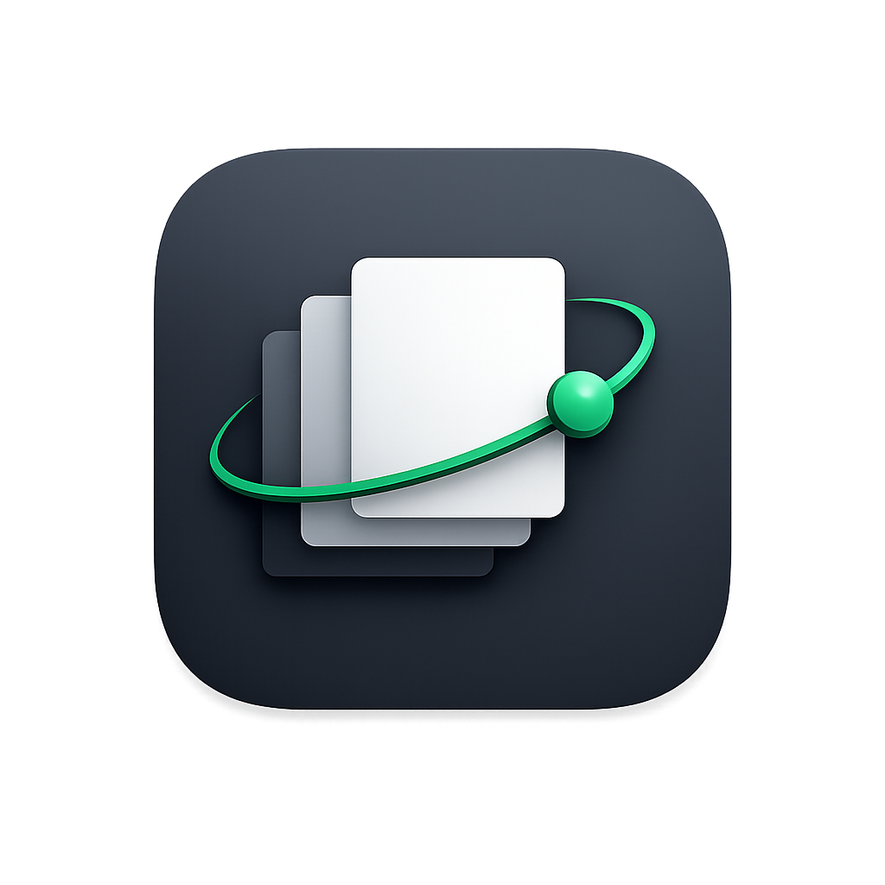

<p align="center">
  
</p>

<h1 align="center">OpenFolio</h1>

<p align="center">
  <strong>OpenFolio remembers who told you what.</strong>
</p>

<p align="center">
  Private, evidence-first iMessage recall for macOS.
</p>

<p align="center">
  
  &nbsp;
  <a href="https://github.com/unlatch-ai/OpenFolio/blob/main/LICENSE"></a>
</p>

<p align="center">
  <a href="https://openfolio.ai">Website</a> &middot;
  <a href="docs/product-contract.md">Product Contract</a> &middot;
  <a href="docs/zero-network-threat-model.md">Privacy Model</a> &middot;
  <a href="docs/release-checklist.md">Release Checklist</a> &middot;
  <a href="https://github.com/unlatch-ai/OpenFolio/issues">Report an Issue</a>
</p>

---

OpenFolio searches your iMessage history on your Mac, helps you find the person,
fact, or message you remember, and lets you verify it in the original
conversation.

It is not a relationship-health score, personal CRM, reminder system, or AI
answer engine. Search returns evidence from the archive rather than generated
prose.

## What it does

- **Search first** — Search messages, people, and conversations with exact words
  or meaning-based retrieval. `⌘K` returns to the full Search page.
- **Evidence you can verify** — Message results identify their source and open
  the exact cited message with its surrounding conversation.
- **People dossiers** — Browse the people represented in your history and scope
  search to one person without inferring relationship quality.
- **Conversation archive** — Read original local records without a composer,
  reply surface, or iMessage imitation.
- **Wrapped** — Revisit deterministic annual totals, message rhythms, and top
  people without generated narratives.
- **Exact-search fallback** — Full-text search continues while the semantic
  index is preparing or if the local model is unavailable.
- **No account required** — Local entry does not use hosted sign-in, cloud sync,
  provider keys, or a website connection.

## Local privacy boundary

OpenFolio reads `~/Library/Messages/chat.db` in read-only mode after you grant
Full Disk Access. It creates a separate SQLite archive and builds embeddings
locally with a bundled q8 `all-MiniLM-L6-v2` ONNX model (about 23 MB). The model
is pinned and hash-verified; there is no remote-model fallback.

The production app implements a deny-all network policy covering Internet, LAN,
loopback, DNS, socket, navigation, download, and external HTTP(S) handoff paths.
It has no automatic updater, telemetry, hosted AI, or browser-based account
flow.

The claim that a particular signed release makes zero network requests remains
gated on artifact inspection and PID-attributed traffic observation of that
exact signed build on real macOS. Source inspection, unit tests, CSP, and an
unsigned package do not prove the signed-release claim. See the
[zero-network threat model](docs/zero-network-threat-model.md) for the complete
boundary and release gate.

## Install and update

Download the latest build from [GitHub Releases](https://github.com/unlatch-ai/OpenFolio/releases/latest),
move `OpenFolio.app` into `/Applications`, and grant Full Disk Access when macOS
asks.

OpenFolio updates manually. Quit the app, download the new release, and replace
the existing app in `/Applications`. Your imported archive, index, and settings
remain in macOS Application Support outside the app bundle.

## Building from source

**Requirements:** Node.js 22+, [pnpm](https://pnpm.io/) 10+, macOS for Messages
access.

```bash
git clone https://github.com/unlatch-ai/OpenFolio.git
cd OpenFolio
pnpm install
pnpm approve-builds
pnpm install
pnpm build
pnpm dev
```

If you change `packages/core`, rebuild it before testing the Electron app:

```bash
pnpm --filter @openfolio/core build
```

<details>
<summary><strong>Common commands</strong></summary>

| Command | Description |
|---------|-------------|
| `pnpm dev` | Run the Mac app in development mode |
| `pnpm dev:web` | Run the public website locally |
| `pnpm typecheck` | Type-check all packages |
| `pnpm test` | Run all tests |
| `pnpm build` | Build all packages |

</details>

## Architecture

```text
apps/
  mac/           Electron app and Editorial Archive renderer
  web/           Public landing page and documentation

packages/
  core/          Local SQLite archive, Messages import, search, embeddings,
                 analytics, and the canonical behavior layer
  shared-types/  Shared local contracts
  shared-tokens/ Semantic visual tokens
```

Other experimental packages can exist in the repository, but they are not part
of the current product pitch or required local entry path.

### Key technologies

- **Electron + React 19** — macOS shell and renderer
- **node:sqlite** — local archive and full-text index
- **Transformers.js** — bundled local `all-MiniLM-L6-v2` embeddings
- **Tailwind v4 + semantic tokens** — shared Editorial Archive visual system
- **Zustand and Recharts** — local UI state and deterministic visualizations

## Contributing

Contributions are welcome. Open an [issue](https://github.com/unlatch-ai/OpenFolio/issues/new)
for bugs and proposals. Before submitting a pull request, run `pnpm typecheck`
and `pnpm test`.

## License

[AGPL-3.0](LICENSE)

---

<p align="center">
  Built by <a href="https://github.com/TheSnakeFang">Kevin Fang</a>
</p>
